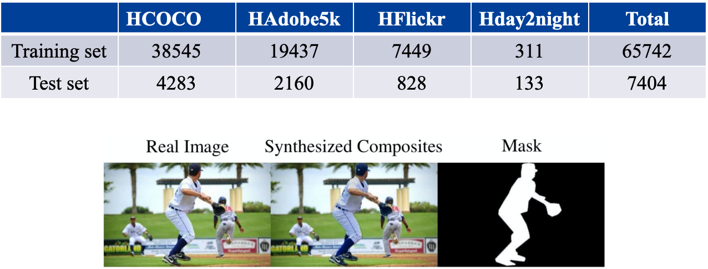

# final-priject-image_harmonization
this is a final project for course of Machine Learning

##Image Composition  
Goal-1: generates a composite image by extracting the foreground of one image and pasting it on the background of another image.  
Goal-2: adjusts the appearances of the foreground region to make it compatible with the new background. 
Goal-3: learns the mapping between an input image and an output image. 

 

##GAN 
Structure: Generator G and Discriminator D, where generator is used to generate fake image and discriminator aims to identify real and fake images. 

 

##Experiment 
1.Dataset: including 4 sub-dataset 

 

2.toolset： 
Linux 
Python 3 
Pytorch 1.2 
NVIDIA GPU 1080 Ti 

3.Training： 
Image resize 256x256  
Trade-off parameter ℷ = 0.01 
LeakyReLU  activate function convolution layers 
Adam optimizer 
0.002 learning rate 
evaluation metric – MSE 

